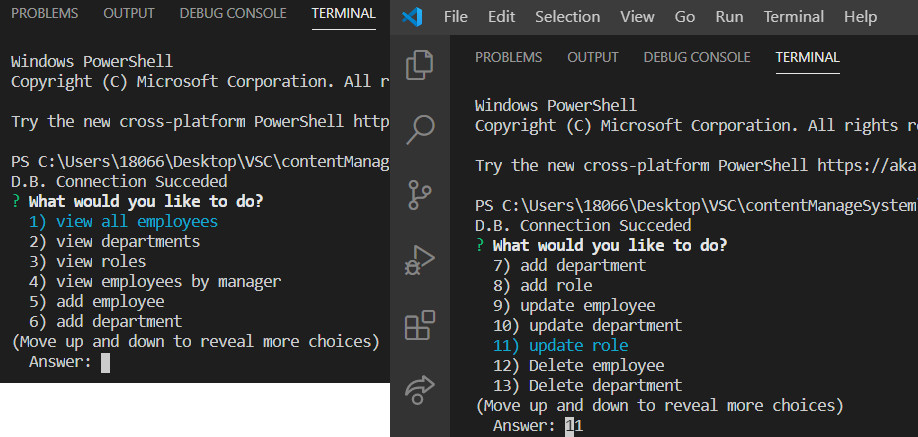

# Content-management-system
## This system works using basic sql queries I decided not to use express 

    View-Employees,Roles and departments
    Add-Employees,Roles and departments
    Update-Employee Data,Roles and Department Data
    Delete-Employees, Roles and Departments
    Look up employee by manager, role or departments

  

  ## view employees by roles or managers

  ## Add  example
  

  ## Update Example
  

  ## Delete Example 
  